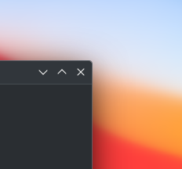
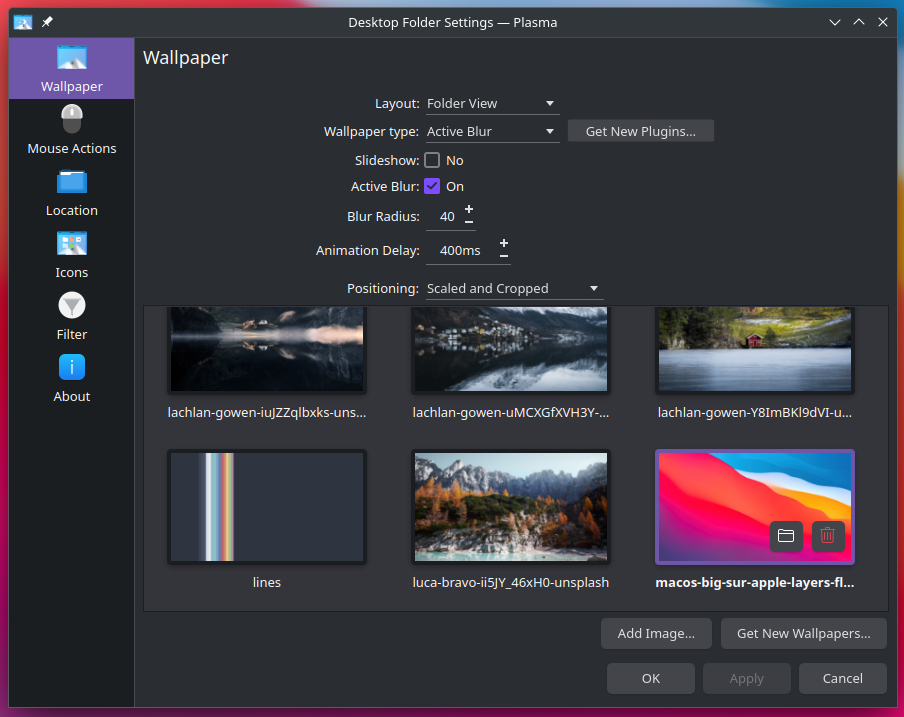

[//]: # (note for me - Linux/Unix Desktops > Desktop Extensions > KDE Plasma Extensions > Plasma Wallpaper Plugins)

  

<h1 align="center">Active Blur <i>- a plasma wallpaper plugin</i></h1>

https://user-images.githubusercontent.com/30547569/233472177-a752d175-291a-4ba3-877d-dcd25a79b6e4.mp4

## Description

Blur the wallpaper if a windows is active.

### main feature

- live thumbnail preview
- keep all the behavior of the default `image` plugin made by kde like :
    - auto apply the wallpaper on click
    - add color and blur option in function of the positioning
- give you the ability to deactivate the effect
- give you the ability to change the blur radius and the animation delay
- `new` the slideshow wallpaper type is available too 

### history

My own code for replacing [inactiveblur](https://github.com/Zren/plasma-wallpapers/tree/master/inactiveblur) that it seems to be abandoned.

I have duplicated the default KDE `image` plugin so all the default effect and behavior is still present.

## Installation

- Download the last release and extract it and place the folder into `~/.local/share/plasma/wallpapers/` next you need to rename it into `a2n.blur`
- Download via [the KDE store](https://www.pling.com/p/2017888/)
- Install it via the wallpaper plugin ("get new plugin" button into Desktop Folder Settings)

## Configuration

| Name        | Description                                                      | Result                                                       |
|-------------|------------------------------------------------------------------|--------------------------------------------------------------|
| Active Blur | If you want the effect or not                                    | The effect is active or not                                  |
| Slideshow   | If you want your wallpaper to be in slideshow             | Your wallpaper is a slideshow or a single image         |
| Blur Radius | Give you the possibility to customize the blur radius            | The blur is stronger or weaker                               |
| showDesktop | Give you the possibility to customize the delay of the animation | The blur appears and disappears more quickly or less quickly |

## Code of conduct, license, authors, changelog, contributing

See the following file :
- [code of conduct](CODE_OF_CONDUCT.md)
- [license](LICENSE)
- [authors](AUTHORS)
- [contributing](CONTRIBUTING.md)
- [changelog](CHANGELOG)
- [security](SECURITY.md)

## Roadmap

- bug : the first time a user selects slideshow the wallpapers are not displayed
- related : make a kwin script to affect all types of wallpapers ([see that repo](https://github.com/bouteillerAlan/activeblur))

## Want to participate? Have a bug or a request feature?

Do not hesitate to open a pr or an issue. I reply when I can.

## Want to support my work?

- [Give me a tips](https://ko-fi.com/a2n00)
- [Give a star on github](https://github.com/bouteillerAlan/blurredwallpaper)
- [Add a rating and a comment on Pling](https://www.pling.com/p/2017888/)
- [Become a fan on Pling](https://www.pling.com/p/2017888/)
- Or just participate to the developement :D

### Thanks !
